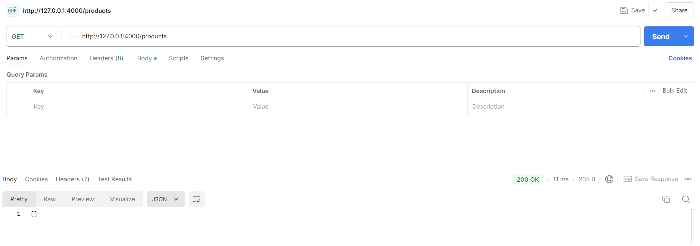
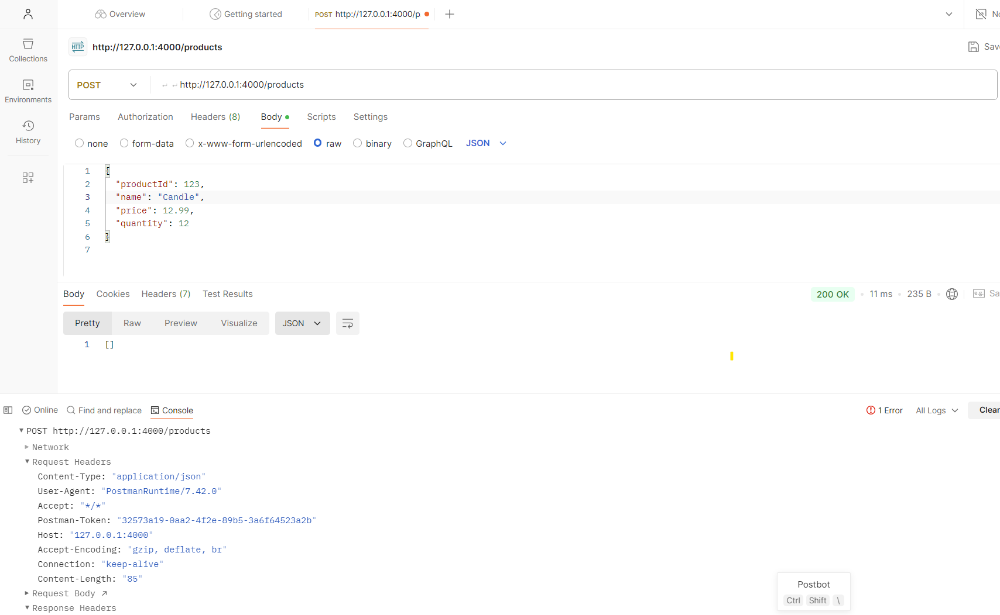
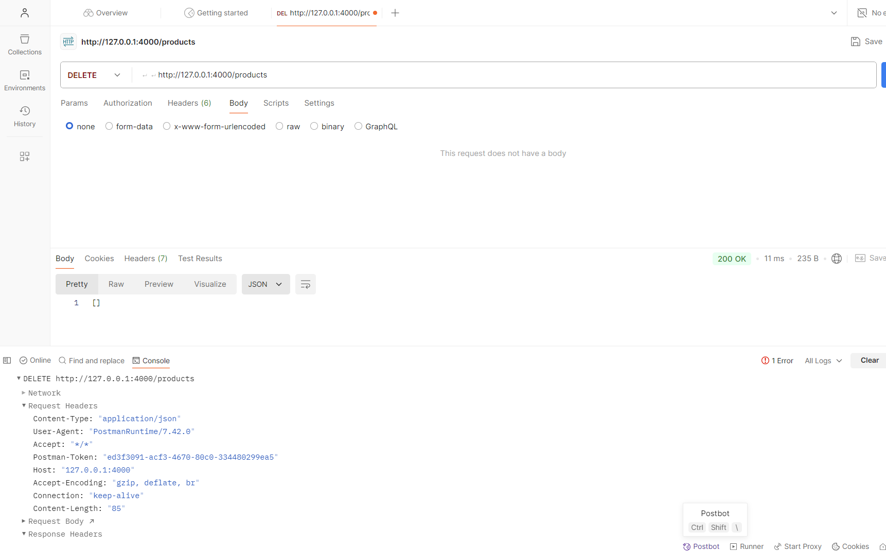

# Product Management API

This project implements a simple Product Management API with the following functionalities:

## Features

- HTTP GET, POST, and DELETE request handling for products.
- In-memory storage of product data.
- Logging of server start-up information and request/response details.
- Request counters for GET and POST requests.

## Screenshots





## Getting Started

### Prerequisites

- Node.js
- npm (Node Package Manager)

### Installation

1. Clone the repository:
   ```bash
   git clone https://github.com/Rajan124/Assignment1.git
   cd your-project-directory
